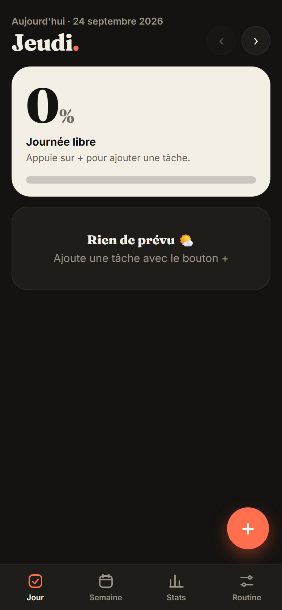

# ✅ Everyday — suivi de routine

Application web installable (PWA) pour suivre ses habitudes jour après jour : la liste du jour,
un taux d'accomplissement et des statistiques pour voir sa régularité dans le temps.

**▶ [Ouvrir l'application](https://tanim-veer.github.io/suivi-habitudes/)** — fonctionne aussi hors ligne, et s'installe sur téléphone (« Ajouter à l'écran d'accueil »).

  

## Fonctionnalités

- **Vue du jour** : les tâches et habitudes prévues, avec le pourcentage accompli et un objectif quotidien
- **Tâches récurrentes** selon les jours de la semaine, ou ponctuelles
- **Reporter à demain** une tâche non faite
- **Bilan de la journée** (objectif atteint ou manqué) et journal des bilans
- **Vue semaine** pour naviguer d'une semaine à l'autre
- **Statistiques** : calendrier des 16 dernières semaines, taux de réussite par habitude sur 30 jours, séries de jours consécutifs
- **Export / import** des données pour les sauvegarder

## Technique

- HTML, CSS et JavaScript, sans framework ni dépendance
- Données stockées dans le navigateur (`localStorage`) : aucun compte ni serveur
- Service worker et manifeste web pour le mode hors ligne et l'installation
- Hébergé sur GitHub Pages

## Lancer en local

Aucune installation : il suffit de servir le dossier, par exemple avec `python -m http.server`,
puis d'ouvrir `http://localhost:8000`. Le service worker a besoin d'être servi en HTTP : ouvrir
`index.html` directement depuis l'explorateur de fichiers ne l'active pas.
